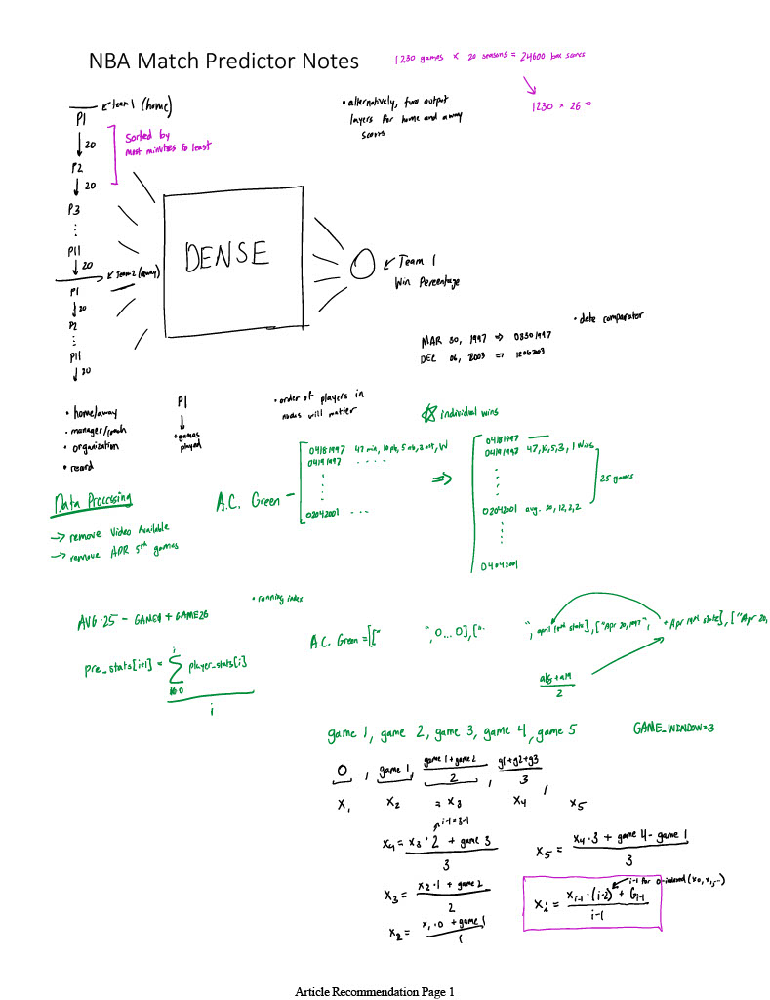
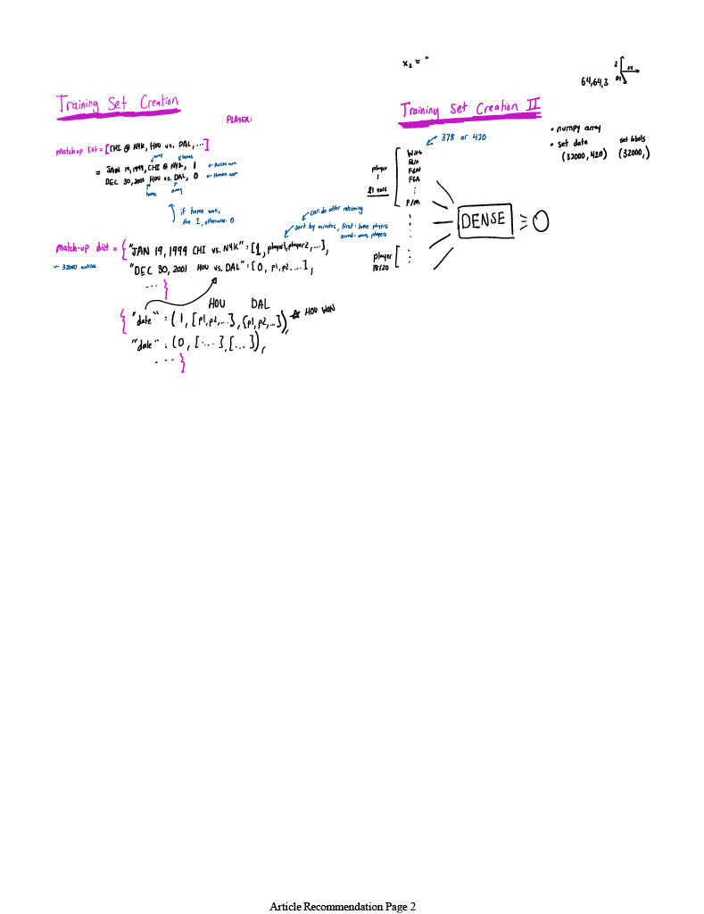

# NBA-Match-Predictor

* Utilized a csv file of player box scores since 1997 (when plus/minus became recorded around the league) and processed this data
* Created a list of match-ups that would ultimately be iterated through to create the input set for the model. There are about 12 thousand match-ups, or samples, each with a logit output of 1 or 0 (representing whether or not the home team won the match-up)
* Created a dictionary of a dictionary of a list (key=player, value=dict(key=game data, value=box score as a list)) so that the input set could efficiently be created when iterating through the list of match-ups (which also had a roster for each team for each game)
* With these two essential datasets, built the training and testing data as NumPy arrays and trained the model
* Leveraged Amazon SageMaker clusters to experimentally find the optimal hyperparameters for the model
* Achieved 73% accuracy on the newly seen testing set, showing promise for use as an AI-betting model for the NBA that could be used for the upcoming 2024-25 season

